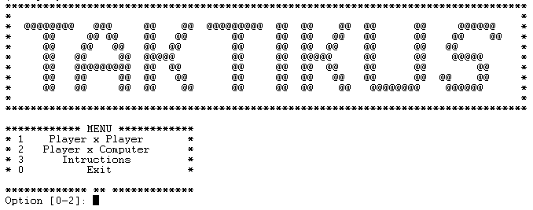
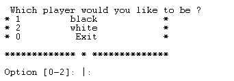
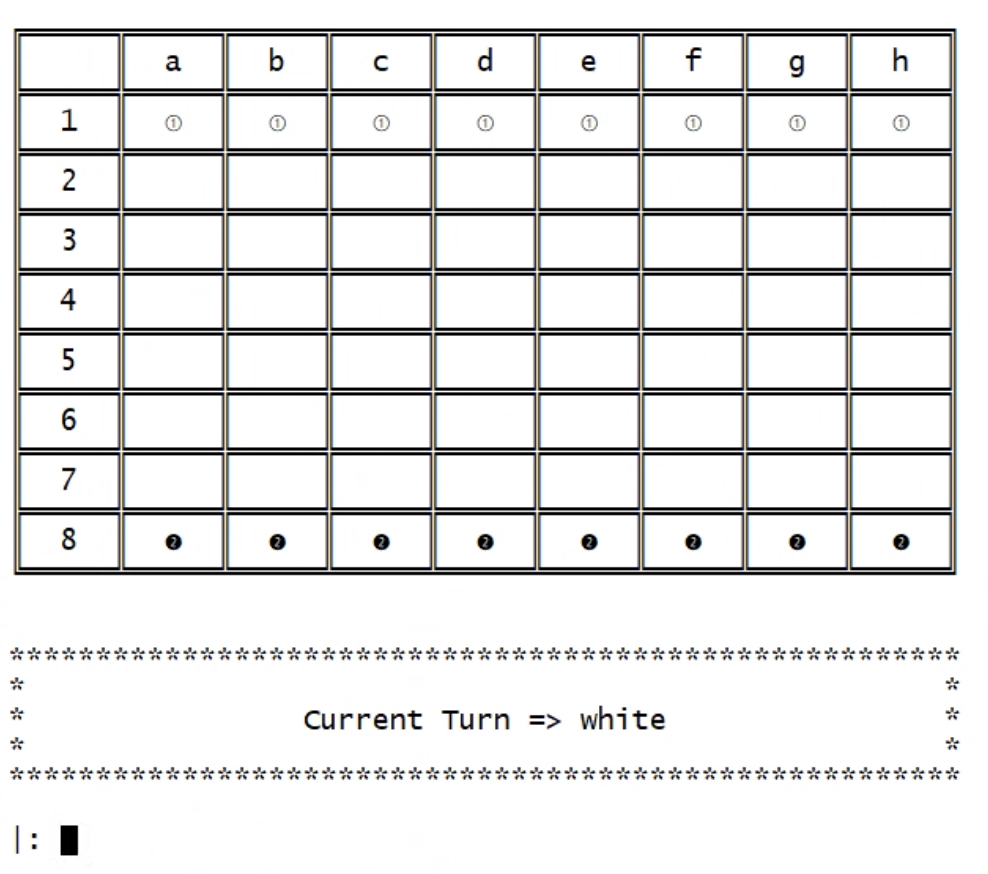
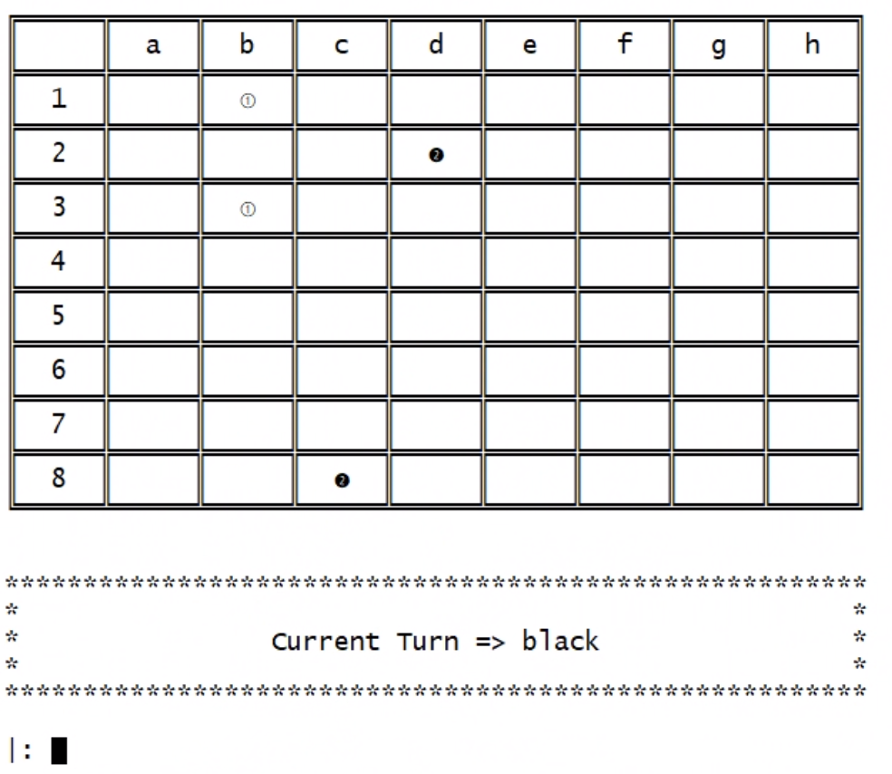
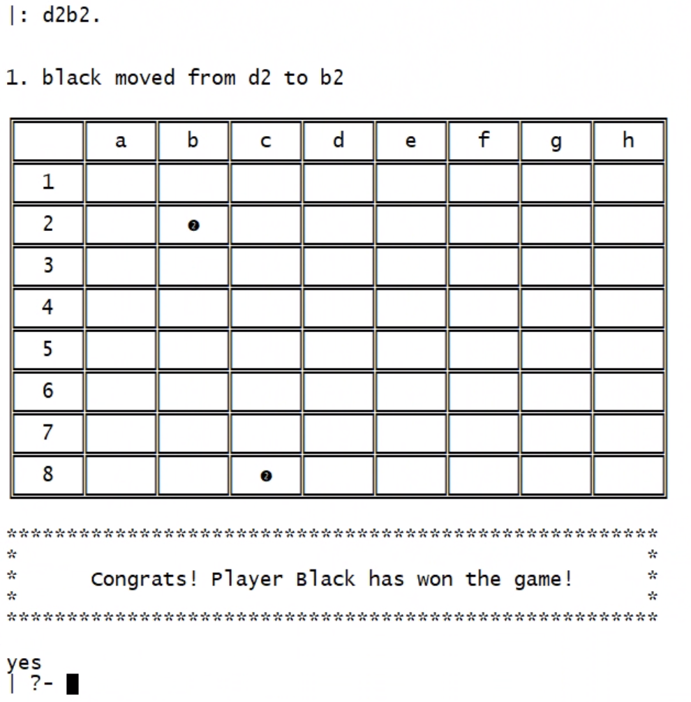
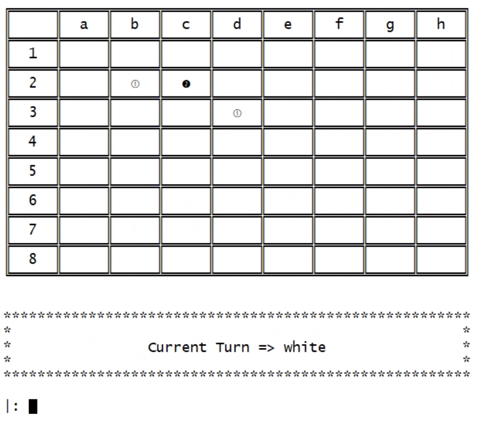
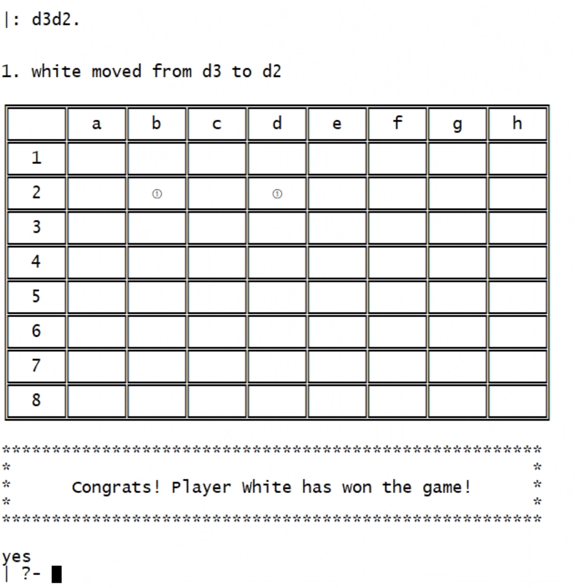

# Taktikus

Taktikus is a strategy game in chess-like fashion, where two players attempts to get each other marbles until one of the players has only one marble left.

## Game Rules
- Played by 2 players (white and black, respectively)
- On a 8x8 chess-like board (with no colors)
- Each player starts with 8 pieces in their first row
- Each turn a player moves one piece (let white start)
- The pieces have a rook-like movement (diagonal or horizontal as far as the player want), but cannot jump over a piece (either color)
- The objective is to capture the opponent's pieces
- Capturing occurs in 2 ways:
    1. by capturing one or more of the opponents marbles (in an unbroken row or column) between two of one’s own marbles. 
    2. moving a marble into an empty space in-between two of the opponents marbles, which are both captured.
- Game ends:
    When one player is left with 1 or less pieces on the board

[See More Details Here](https://boardgamegeek.com/boardgame/80811/taktikus)

## Installation And Execution

### Requisites
- SICStus Prolog

### Font Configuration For SICStus on Windows:
- Font: Lucida Console
- Font style: Regular
- Font Size: 14

### Execution
1. Direct into the `/src` folder;
2. Open SICStus Prolog either in command line interface (run `sicstus`) or within the console;
3. Run `compile('game.pl').` to compile the game application or if you are using the console `File` -> `Compile` -> `game.pl`;
4. To start the game, run `play.`

### How to play

In this version of the game there are two main game mode:

- Player x Player - Where two players face each other, taking turns.
- Player x Computer Where the player faces the machine, with a single level of dificulty so far (Level 1 computer, which makes random moves).
- Different Board Sizes can be selected (from 3x3 to 9x9), but 8x8 is recommended to be played, since it is the official game board size.

### Board
Our `GameState` predicate is composed of `GameBoard` and `PlayerTurn` (`GameState` = `[GameState|PlayerTurn]`), where:

- `GameBoard` is represented by a 2d list, in which each sublist is a line in the board.
In the `initial_state(+Size, -GameState)` predicate, an initial gameboard is generated with first and last rows being the player pieces (white and black respectively) and the rest being the empty cells that the pieces can move.
- `PlayerTurn` can either be a value of `black` or `white` indicating the current player turn.

The view of the game is output by the predicate `display_game(+GameState)`, where it loops through the `GameBoard` cell by cell and outputs the respective element, and then outputs the player that has to make a move in the current turn.

#### **Player x Player**

After choosing the size of the square board the game will begin being the player one the one to control the white marblers and player 2 the one to control the black marbles.

#### **Player x Computer**

After choosing the square board size like in the first option now we need to choose which player we wan't to be.

If the player choose to be black, then the computer will make it's first move and the game will begin soon after that.

After every movement, being that from the player or the computer, we have presented in the screen the current movement with a marble initial position and last position.

### Movement
 Each turn a player is asked to input their movement, the input should be similar to the standard method for recording and describing the *moves in a game of chess for a pawn* (e.g. to move a piece on position B1 to B3, input `b1b3.`, everything together without spaces)

 The input that the player entered, is validated and parsed, when an invalid move is taken, a error message is returned and the player is asked to input again.

The validation proccess is also combined with the predicate `valid_moves_by_piece(+PiecePosition, +GameBoard, -ListOfMoves)` by checking if the move that the player has entered is one of a valid moves on the `ListOfMoves`.

After parsing and validating the input, a move is executed using the predicate `move(+GameState, +Move, -NewGameState)`, which replaces the piece on the old position on the board by `empty`, and the new position is replaced with current player's piece.

### List of valid moves

The combination of row column determines what is a position, and the direction of a move can only be vertical and horizontal movements (no diagonals).

We endup choosing a very straight foward and simple way to play, once it's your turn all the player need to type in is the current position of a marble and the desired new position.

The predicates used for this validations is  `valid_moves_by_piece(+PiecePosition, +GameBoard, -ListOfMoves)`

The predicate `valid_moves(+GameState, -ListOfMoves).`, uses the current game state (game board + current player turn) to find out all the possible moves that the current player can make, this is done by checking all the horizontal and vertical valid moves that each piece of their color can take and stored into the `ListOfMoves`.

### Computer

The game can be also played in the player x computer mode, where the player is first asked in the main menu the color that one wants to play, after that it will be headed into a `computer_player_gameloop`, where the computer and the player takes turns on their play.

1. On computer's turn, it chooses a move using the `choose_move(+GameState, +Level, -Move)` , which uses the predicate mentioned previously `valid_moves(+GameState, -ListOfMoves)` to give a list of valid moves that the current pieces can make.
2. Then, the predicate `random` is used to give a random index in the list of valid moves, and this move is selected, and played by the computer.

### Game Over

For validation of game over, we used a combination of verification in the Board from within the Game State and Setting a Flag from within the game loop predicates (this includes `computer_player_gameloop` and `player_player_gameloop` predicates).

1. For each game loop, we first check if the current game state (given by `GameState`) has sastified a condition to end the game, using the predicate `game_over(+GameState, -Winner)`.
2. This predicate checks whether the current player has its pieces amount inferior to 2, and if so, we can conclude that the previous player has played a move that gave a 'checkmate' to this current player, and therefore conclude with a winner, and the game loop is stopped.
3. If there is not a game over condition, then `Winner` will be given the value `none` and the game will be continued.

### Example of Game winning

The capture can occour if horizontally or vertically: 
-  you position your marble in between two enemy marbles

- you position two of your marbles around an enemy marble.

### Conclusions

The change from Haskell to Prolog was a bit challenging and the ammount of time we had for this second project as also short but, prolog seems to be a simpler logic language when compared to haskell, specially if you start looking at prolog as you look to a database.

Nevertheless, the lack of expertise took a huge toll in our development and the lack of knowledge of which components are more importaint the others so we could focus in what could guarantee more points.

As a working student i had quite alot of dificulty to follow the subject in time and to keep up with the rest of the students which lead to a late understanding of what was needed in terms of theoretical and practical knowledge to contribute to the project.

### Bibliography
***
- [Board game geek](https://boardgamegeek.com/boardgame/80811/taktikus)
- [SicTus 4.7.](https://sicstus.sics.se/sicstus/docs/latest4/html/relnotes.html/)

