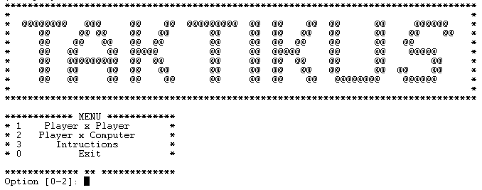
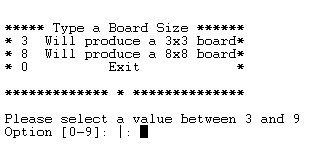
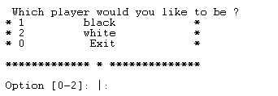
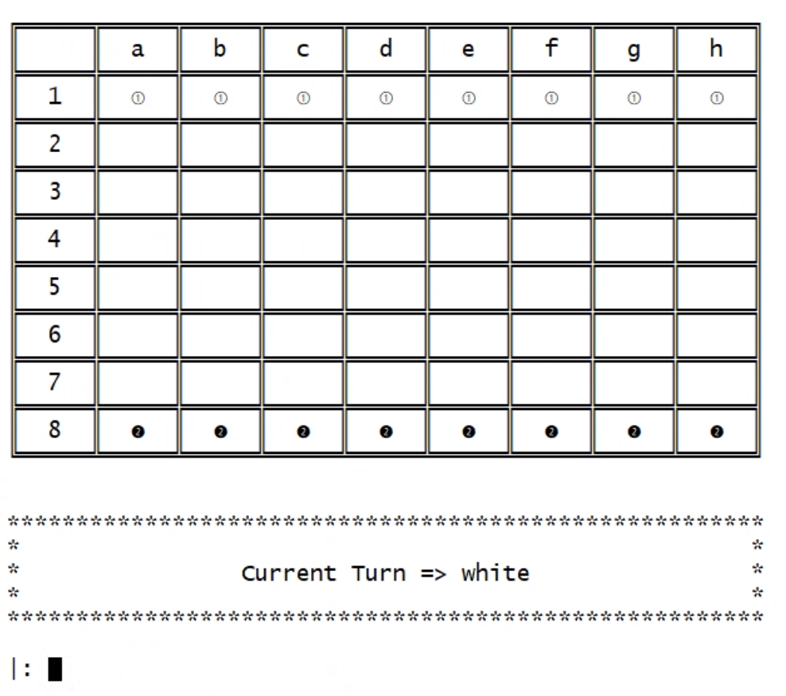
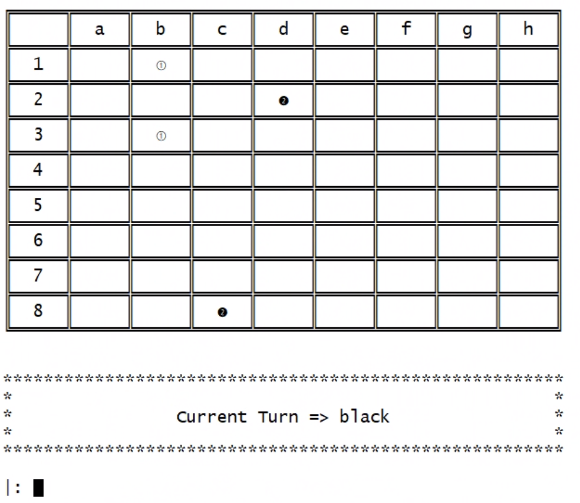
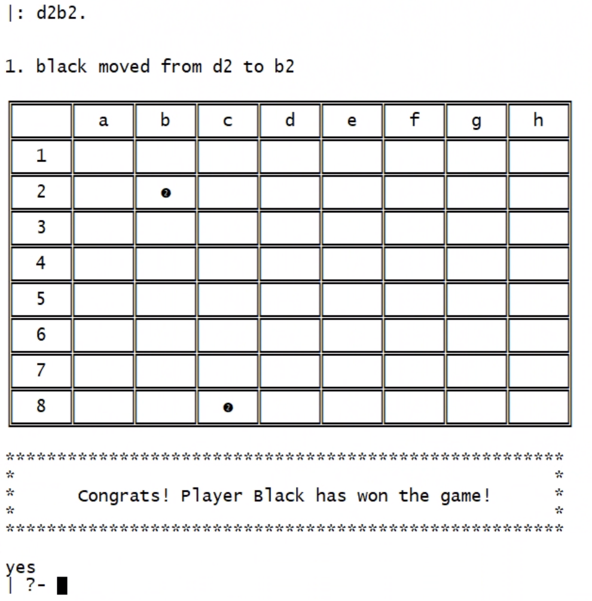
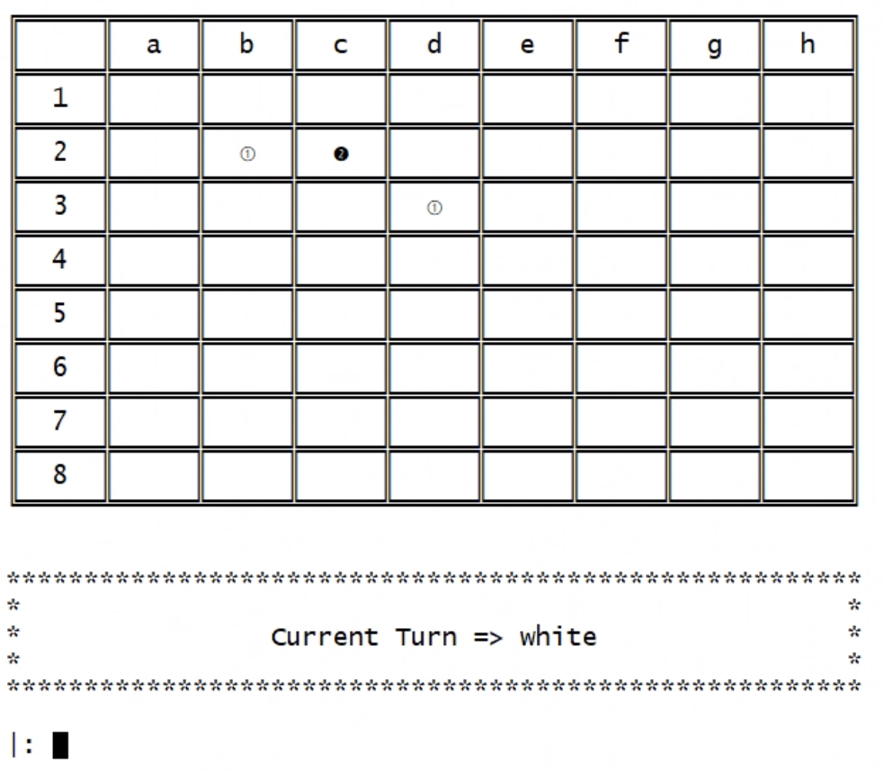
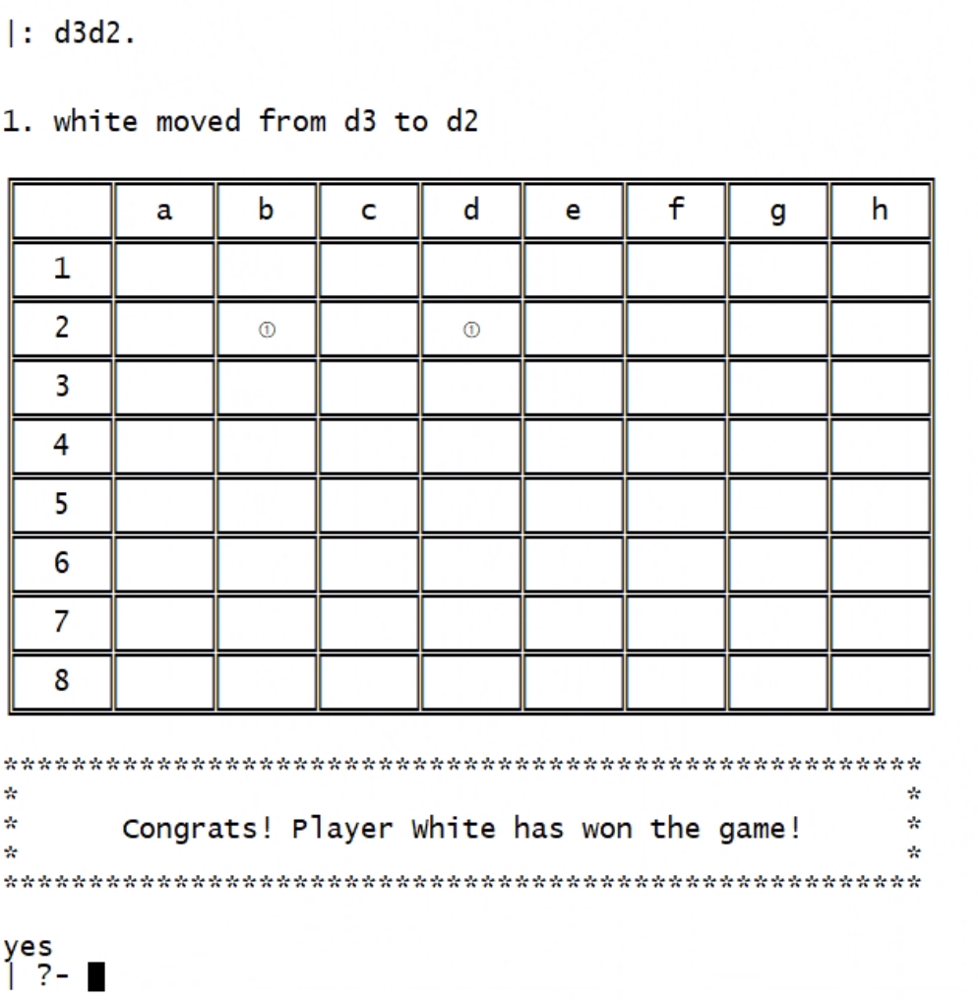

# Taktikus

Taktikus is a chess-like game based, where two players attempts to get each other marbles until one of the players has only one marble left.

## Game Rules
- Played by 2 players (white and black, respectively)
- On a 8x8 chess-like board (with no colors)
- Each player starts with 8 pieces in their first row
- Each turn a player moves one piece (let white start)
- The pieces have a rook-like movement (diagonal or horizontal as far as the player want), but cannot jump over a piece (either color)
- The objective is to capture the opponent's pieces
- Capturing occurs in 2 ways:
    1. by capturing one or more of the opponents marbles (in an unbroken row or column) between two of one’s own marbles. 
    2. moving a marble into an empty space in-between two of the opponents marbles, which are both captured.
- Game ends:
    When one player is left with 1 or less pieces on the board

[See More Details Here](https://boardgamegeek.com/boardgame/80811/taktikus)


## Installation And Execution

### Requisites
- SICStus Prolog

### UI Configuration:
- Font: Lucida Console
- Font style: Regular
- Font Size: 14

### Execution
1. Direct into the `/src` folder;
2. Open SICStus Prolog either in command line interface (run `sicstus`) or within the console;
3. Run `compile('game.pl').` to compile the game application or if you are using the console `File` -> `Compile` -> `game.pl`;
4. To start the game, run `play.`

## Game Logic
***

### Board

The board is represented by a list of lists, in which each sublist is a line in the board.
The first and last lists are the player marbles (white and black respectively) and the lists in between are the empty spaces.

??? Print of the Board (If possible empty)

The predicate used in this part is a view component `display_game(+GameState)`
??? Explain better the predicate?

### Player

The player can choose to manipulate the black or white marbles.

??? Talk about the predicate related to player

In the board graphic representation, for the white player we are using a white coin and for the black players we are using a black coin.

The predicate `ui/2` to associate the player marble with a ASCII code.
```
ui(black, 10123).
ui(white, 10112).
ui(empty, 43).
```


### How to play

In this version of the game there are two main game mode:

- Player x Player - Where two players face each other, taking turns.
- Player x Computer Where the player faces the machine, with a single level of dificulty so far.

Here the predicates `game_loop` and `change_game_turn` are the responsible for the game cycle and deciding the turn for each player.



#### **Player x Player**

After choosing the size of the square board the game will begin being the player one the one to control the white marblers and player 2 the one to control the black marbles.



#### **Player x Computer**

After choosing the square board size like in the first option now we need to choose which player we wan't to be.

If the player choose to be black, then the computer will make it's first move and the game will begin soon after that.



After every movement, being that from the player or the computer, we have presented in the screen the current movement with a marble initial position and last position.




### List of valid moves

The combination of row column determines what is a position, and the direction of a move can only be vertical and horizontal movements (no diagonals).

The predicates used for this validations is  `valid_moves_by_piece(+PiecePosition, +GameBoard, -ListOfMoves)`

??? Explain  better the predicate

We endup choosing a very straight foward and simple way to play, once it's your turn all the player need to type in is the current position of a marble and the desired new position.


### Movement
 Each turn a player is asked to input their movement, the input should be similar to the standard method for recording and describing the *moves in a game of chess for a pawn* (e.g. to move a piece on position B1 to B3, input `b1b3.`, everything together without spaces)

??? Explain the predicates used ??

### Computer

???


### Game Over

For validation of game over, we used a combination of verification in the Board from within the Game State and Setting a Flag from within the `game_loop`.

1. After a movement, we check if there was a capture and if there was a capture we check the ammount of left marbles with the oposite player.
2. After verify this, we check if this ammount is inferior to 2 and if is, we set the player winner to the current player.
3. After that in the `game_loop` We set the used flag to true and we end the current game.

### Example of Game winning

The capture can occour if horizontally or vertically: 
-  you position your marble in between two enemy marbles


- you position two of your marbles around an enemy marble.




### Game State evaluation

??? If we manage to have this, explain a little this predicate `value(+GameState, +Player, -Value)`

### Conslusions

The change of Haskell to Prolog was a bit challenging and the ammount of time we had for this second project as also short but, prolog seems to be a simpler logic language when compared to haskell, specially if you start looking at prolog as you look to a database.

Nevertheless, the lack of expertise took a huge toll in our development and the lack of knowledge of which components are more importaint the others so we could focus in what could guarantee more points.


### Bibliography
***
- [Board game geek](https://boardgamegeek.com/boardgame/80811/taktikus)
- [SicTus 4.7.](https://sicstus.sics.se/sicstus/docs/latest4/html/relnotes.html/)

