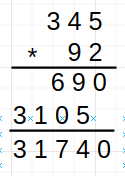

##  Trabalho Prático PFL 1

### Primeira Parte

#### [Fib.hs](Fib.hs)

#### 1.1)
Uma função recursiva, `fibRec`;
O tipo desta função é: 
`fibRec :: (Integral a) => a -> a`
```
fibRec :: (Integral a) => a -> a
fibRec 0 = 0
fibRec 1 = 1
fibRec n = fibRec (n-2) +fibRec (n-1)
```

#### 1.2)
Crie uma versão otimizada da função anterior, chamada `fibLista`, usando uma lista de
resultados parciais tal que `(lista !! i)` contém o número de Fibonacci de ordem i
(programação dinâmica).
```
fibLista :: Num p => Int -> p
fibLista 0 = 0
fibLista 1 = 1
fibLista n  = fibs !! (n-1) + fibs !! (n-2) where
  fibs = map fibLista [0..]
```

#### 1.3)
Implemente outra versão, chamada `fibListaInfinita`, para gerar uma lista infinita com
todos os números de Fibonacci e retornar o elemento de ordem n.
```
fibListaInfinita :: Num a => Int -> a
fibListaInfinita n = listaInfinita !! n
    where listaInfinita  = 0 : 1 : [a + b| (a,b)<- zip listaInfinita (tail listaInfinita)] --lista infinita com todos os números de Fibonacci
```

### Segunda Parte

#### [BigNumber.hs](BigNumber.hs)

Deveriamos implementar um módulo para aritmética para `BigNumber`, que posteriormente seria utilizado para implementar novas versões das funções da alínea 1.

Um `BigNumber` é representado por uma lista dos seus dígitos, por isso decidimos implementar um `type BigNumber = [Int]`.


##### 2.1)
Uma definição do tipo BigNumber.
```
module BigNumber where

type BigNumber = [Int]
```
##### 2.2
A função scanner, que converte uma string em `BigNumber`. O seu tipo é: 
`String -> BigNumber`
```
-- Converte string para BigNumber
scann :: String  -> BigNumber
scann n = map(`mod` 10) $ reverse $ takeWhile (> 0) $ iterate (`div`10) (read n::Int)
```

##### 2.3
A função output, que converte um `BigNumber` em string. O seu tipo é: 
`BigNumber -> String`
```
-- Converte BigNumber para numeros inteiros
dec2int :: [Int] -> Int
dec2int = foldl(\x y -> 10 * x + y) 0

-- Converte BigNumber para String
output :: BigNumber -> String
output xs = show (dec2int xs)
```

##### 2.4) 
A função `somaBN`, para somar 2 numeros do tipo `BigNumber`.
Esta função é dividida em 6 casos seguintes:
- Soma entre 2 positivos
- Soma entre 2 negativos
- Soma entre 1 positivo e 1 negativo, onde o abs(|positivo|) > abs(|negativo|)
- Soma entre 1 positivo e 1 negativo, onde o abs(|positivo|) < abs(|negativo|)
- Soma entre 1 negativo e 1 positivo, onde o abs(|negativo|) > abs(|positivo|)
- Soma entre 1 negativo e 1 positivo, onde o abs(|negativo|) < abs(|positivo|)

As 2 funções principais que foram usadas para calcular as somas dos casos referidos são:
- `subPosPos`, que faz a subtração entre 2 numeros positivos, onde o primeiro parâmetro de entrada tem valor absoluto maior que o segundo
- `somaPosPos`, que faz a soma entre 2 numeros positivos

Basta estas 2 funções para conseguir calcular os 6 casos mencionados, mudando o sinal e a ordem de entrada
Exemplo:


```
-- Soma de dois BigNumber
somaBN :: BigNumber -> BigNumber -> BigNumber
somaBN bn1 bn2
    | not (checkIfNegative bn1) && not (checkIfNegative bn2) = reverse (somaPosPos (reverse bn1) (reverse bn2) 0 [])  -- 2 positivos
    | checkIfNegative bn1 && checkIfNegative bn2 = changeSign (reverse (somaPosPos (reverse (changeSign bn1)) (reverse (changeSign bn2)) 0 []))  -- 2 negativos
    | absBiggerThan bn1 bn2 && not (checkIfNegative bn1) = removeLeadingZeros (reverse (subPosPos (reverse bn1) (reverse (changeSign bn2)) 0 [])) -- positivo + negativo, abs(positivo) > abs(negativo)
    | absBiggerThan bn2 bn1 && not (checkIfNegative bn1) = changeSign (removeLeadingZeros (reverse (subPosPos (reverse (changeSign bn2)) (reverse bn1) 0 []))) -- positivo + negativo, abs(positivo) < abs(negativo)
    | absBiggerThan bn1 bn2 && checkIfNegative bn1 = changeSign ( removeLeadingZeros(reverse (subPosPos (reverse (changeSign bn1)) (reverse bn2) 0 []))) -- negativo + positivo, abs(negativo) > abs(positivo)
    | otherwise = removeLeadingZeros (reverse (subPosPos (reverse bn2) (reverse (changeSign bn1)) 0 [])) -- negativo + positivo, abs(negativo) < abs(positivo)

```
##### 2.5) A função subBN, para subtrair dois big-numbers.
Usar a função `somaBN`, só mudando o sinal do segundo parametro de subtração com a função `changeSign`.
```
-- Subtraçao entre dois BigNumber
subBN :: BigNumber -> BigNumber -> BigNumber
subBN bn1 bn2 = somaBN bn1 (changeSign bn2)
```
#### 2.6) A função mulBN, para multiplicar dois big-numbers.

Para atingir o resultado esperada primeiro utilizo a função mulItems que cria uma lista de listas cuja cada item de cada lista é o resultado da multiplicação inteira de um número pelo outro conforme uma multiplicação do primário.


ex:
`mulItems [9,2] [3,4,5]` retorna algo como `[[6,8,10],[27,36,45]]`. 
Em seguida essa lista de listas é tratada para que cada lista interna seja composta por um `BigNumber`, para tal é utilizada a função auxiliar `sumWithCarrySingleton`.
Tendo a lista tratada utilizamos mais duas funções auxiliares em conjunto. `multSumTwo` que faza soma entre dois números acrescentando zeros ao início do menor número esta função utiliza a `somaBN`. A segunda função é `auxMult` que aplica a `multSumTwo` a minha lista de listas tratadas.
Também trabalhamos o sinal dos `BigNumber` a multiplicar com funções auxiliares `checkIfNegative` e `changeSign`.
```
-- Multiplicaçao de dois BigNumber
mulBN :: BigNumber -> BigNumber -> BigNumber
mulBN xs ys
    | checkIfNegative xs && checkIfNegative ys = auxMult (map sumMy (multiplyElements ys xs)) [0]
    | not (checkIfNegative xs) && not (checkIfNegative ys) = auxMult (map sumMy (multiplyElements ys xs)) [0]
    | checkIfNegative xs && not (checkIfNegative ys) = changeSign (removeLeadingZeros (auxMult (map sumMy (multiplyElements ys (changeSign xs))) [0]))
    | otherwise = changeSign (removeLeadingZeros (auxMult (map sumMy (multiplyElements (changeSign ys) xs)) [0]))

```
#### Exemplos de utilização:

```
*BigNumber> mulBN [-2] [1,0]
mulBN [-2] [1,0]
*BigNumber> mulBN [4,5,6] [9,2]
[4,1,9,5,2]
*BigNumber> mulBN [9,9,9,1,0] [5,6,9,8,7]
[5,6,9,3,5,7,1,1,7,0]
```


##### 2.7) A função divBN, para efetuar a divisão inteira de dois big-numbers. 
Foi dividido em 4 casos diferentes:
- 2 numeros positivos
- 2 numeros negativos
- Dividendo negativo e divisor positivo
- Dividendo positivo e divisor negativo

Para cada caso foi criado uma função auxiliar que calcula o quociente e o resto.
Aqui vamos explicar a função `divPosPos` (divisão de 2 numeros positivos). 
A logica é fazer a contagem que o divisor consegue subtrair ao dividendo enquanto o dividendo for positivo. O valor final da contagem será o valor do quociente e o resto será o valor que resta no dividendo.

exemplo: 

    10 / 3 = ?

    10 - 3 = 7, contagem = 1
    7 - 3 = 4,  contagem = 2
    4 - 3 = 1,  contagem = 3

    quociente = contagem = 3
    resto = valor final de dividendo = 1

    resposta: quociente = 3, resto =1

As funções dos outros 3 casos seguem a logica semelhante.

```
-- Divisão de dois BigNumber
divBN :: BigNumber -> BigNumber -> (BigNumber, BigNumber)
divBN bn1 [0]
    = ([-1], [-1])      -- Divisor cannot be 0
divBN bn1 bn2
    | not (checkIfNegative bn1) && not (checkIfNegative bn2) = divPosPos bn1 bn2 [0]
    | checkIfNegative bn1 && checkIfNegative bn2 = divNegNeg bn1 bn2 [0]
    | not (checkIfNegative bn1) && checkIfNegative bn2 = divPosNeg bn1 bn2 [0]
    | otherwise  = divNegPos bn1 bn2 [0]

-- dividend = (divisor * quotient) + remainder
divPosPos :: BigNumber -> BigNumber -> BigNumber -> (BigNumber, BigNumber)
divPosPos bn1 bn2 quotient
    | checkIfNegative (subBN bn1 bn2) = (quotient, bn1)
    | otherwise = divPosPos (subBN bn1 bn2) bn2 (somaBN quotient [1])

divNegNeg :: BigNumber -> BigNumber -> BigNumber -> (BigNumber, BigNumber)
divNegNeg bn1 bn2 quotient
    | checkIfPositive (subBN bn1 bn2) = (quotient, bn1)
    | otherwise = divNegNeg (subBN bn1 bn2) bn2 (somaBN quotient [1])

divNegPos :: BigNumber -> BigNumber -> BigNumber -> (BigNumber, BigNumber)
divNegPos bn1 bn2 quotient
    | checkIfPositive (somaBN bn1 bn2) = (quotient, bn1)
    | otherwise = divNegPos (somaBN bn1 bn2) bn2 (somaBN quotient [-1])

divPosNeg :: BigNumber -> BigNumber -> BigNumber -> (BigNumber, BigNumber)
divPosNeg bn1 bn2 quotient
    | checkIfNegative (somaBN bn1 bn2) = (quotient, bn1)
    | otherwise = divPosNeg (somaBN bn1 bn2) bn2 (somaBN quotient [-1])
```

#### Terceira Parte

Versão das três funções da alínea 1 que trabalhe com `BigNumber`.

```
{-
Alínea 3 Fibonacci Recursive BigNumber
-}
fibRecBN ::BigNumber -> BigNumber
fibRecBN [0] = [0]
fibRecBN [1] = [1]
fibRecBN n = somaBN (fibRecBN (subBN n [2]))  (fibRecBN (subBN n [1]))

{-
Alínea 3 Fibonacci Programacao Dinamica
-}
fibListaBN :: BigNumber -> BigNumber
fibListaBN [0] = [0]
fibListaBN [1] = [1]
fibListaBN n  = somaBN (indexer fibs (subBN n [1])) (indexer fibs (subBN n [2])) where
  fibs = map fibListaBN listBN

{-
Alínea 3 Fibonacci Lista Infinita
-}
fibListaInfinitaBN :: BigNumber -> BigNumber
fibListaInfinitaBN = indexer listaInfinita
    where listaInfinita  = [0] : [1] : [somaBN a  b| (a,b)<- zip listaInfinita (tail listaInfinita)]


--------------------- aux ------------------------

fibBN :: [BigNumber]
fibBN = [0] : [1] : zipWith somaBN fibBN (tail fibBN)

listBN :: [BigNumber]
listBN = iterate (\x -> somaBN x [1]) [0]

indexer :: [BigNumber] -> BigNumber-> BigNumber
indexer (x:xs) [0] = x
indexer (x:xs) n = indexer  xs (subBN n [1])
```

#### Quarta Parte 
No caso do tipo `Int` só é possível de apresentar até a sequência número 92, logo na sequência número 93 não consegue representar com o tipo `int`
Mas se trocar para o tipo `Integer` ou `BigNumber` já será possível de representar.

```
-- fibListaInfinita :: Int -> Int
fibListaInfinita 92
-- retorna 7540113804746346429
fibListaInfinita 93
-- retorna -6246583658587674878

-- fibListaInfinita :: Integer -> Integer
fibListaInfinita 92
-- retorna 7540113804746346429
fibListaInfinita 93
-- retorna 12200160415121876738

-- fibListaInfinitaBN :: BigNumber -> BigNumber
fibListaInfinitaBN [9,2] 
-- retorna [7,5,4,0,1,1,3,8,0,4,7,4,6,3,4,6,4,2,9]
fibListaInfinitaBN [9,3]
-- retorna [1,2,2,0,0,1,6,0,4,1,5,1,2,1,8,7,6,7,3,8]
```

#### Quinta Parte 
Função de divisão que retorna `Nothing` (`Monads` tipo `Maybe`) no caso do divisor ter o valor de 0.
```
safeDivBN :: BigNumber -> BigNumber -> Maybe (BigNumber, BigNumber)
safeDivBN bn1 [0]
    = Nothing      -- Divisor cannot be 0
safeDivBN bn1 bn2
    | not (checkIfNegative bn1) && not (checkIfNegative bn2) = Just (divPosPos bn1 bn2 [0])
    | checkIfNegative bn1 && checkIfNegative bn2 = Just (divNegNeg bn1 bn2 [0])
    | not (checkIfNegative bn1) && checkIfNegative bn2 = Just (divPosNeg bn1 bn2 [0])
    | otherwise  = Just (divNegPos bn1 bn2 [0])
```
